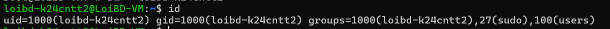
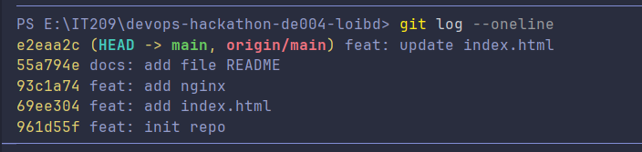

# DevOps Hackathon – Đề 004: Quản lý kho hàng (Inventory)  

## 1. Thông tin sinh viên
| Họ và tên | Mã sinh viên | Lớp | Tài khoản Linux | GitHub | Cổng Nginx |
| :--- | :--- | :--- | :--- | :--- | :--- |
| Bùi Đức Lợi | PTIT-HN-184 | K24-CNTT2 | loibd-k24cntt2 | [LLL2006](https://github.com/LLL2006) | 8082 |

## 2. Môi trường triển khai
- Hệ điều hành: Ubuntu 24.04 LTS (VPS)
- Phiên bản Web Server: Nginx
- Version Control: Git
- Nơi chạy: VPS

## 3. Cấu trúc dự án
```text
devops-hackathon-de004-loibd/
├── src/
│   └── index.html
├── nginx/
│   └── loibd-k24cntt2.conf
├── screenshots/
│   ├── 01-user.png
│   ├── 02-nginx.png
│   ├── 03-ufw.png
│   ├── 04-website.png
│   ├── 05-git-log.png
│   └── 06-update.png
├── .gitignore
└── README.md


4. Cấu hình Nginx
Tham số trong template	Giá trị đã điền	Giải thích
<PORT>	8082	Cổng riêng được phân bổ cho website 
<SERVER_NAME>	221.121.4.90	Địa chỉ IP của máy chủ VPS 
<WEB_ROOT>	/var/www/devops-hackathon-de004-loibd/src	Đường dẫn tuyệt đối trỏ vào thư mục chứa web static
<INDEX_FILE>	index.html	Trang mặc định khi truy cập domain/IP
<TEN_TAI_KHOAN>	loibd-k24cntt2	Tên người dùng dùng để phân tách file log access/error
<ALLOW_DIRECTIVE>	allow all;	Chỉ thị Nginx cho phép mọi request từ bên ngoài
5. Hình ảnh minh chứng
01. Tài khoản người dùng

02. Trạng thái Nginx

03. Cấu hình tường lửa UFW

04. Giao diện Website

05. Lịch sử Git Log

06. Cập nhật Website lần 2


